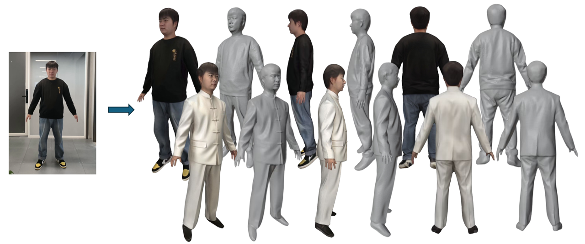
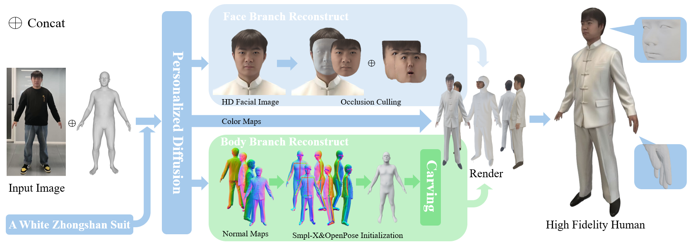

# PHHG

This is the official implementation of PHHG: Personalized High-Fidelity 3D Human Generation from a Single Photo via Dual-Branch Face-Body Reconstruction and Fusion.
<p align="center">
  
</p>
Given a single image of a clothed person, PHHG facilitates detailed geometry and realistic 3D human appearance across various poses in just a few minutes.
<br>
<br>
<div align="center">
    
</div>

### 📝 Update
- __[2025.10.27]__: Share our work！

## 📋 Overview
- [1 - Installation](#installation)
- [2 - Download](#Download)
- [3 - Inference](#Inference)
- [4 - Training](#Training)
- [5 - Acknowledgments](#Acknowledgments)
### 📍 Installation
```
conda create -n phhg python=3.10
conda activate phhg

# torch
pip install torch==2.1.0 torchvision==0.16.0 torchaudio==2.1.0 --index-url https://download.pytorch.org/whl/cu121

# kaolin
pip install kaolin==0.17.0 -f https://nvidia-kaolin.s3.us-east-2.amazonaws.com/torch-2.1.0_cu121.html
```

This project is based on SMPLX. Please download the related models.

### 🖥️ Download

1. Please download the SMPLX models from <span style="color:#1E90FF; text-decoration: underline;">here</span> and place it in ```models```.
2. Please download the pre trained personalized diffusion model from <a style="color:#1E90FF; text-decoration: underline;">here</a> and place it in ```pretrained```.

### 🚀 Inference
1. Please use [Clipdrop](https://github.com/xxlong0/Wonder3D?tab=readme-ov-file) or ```rembg``` to remove the background. If you use ```rembg``` to remove the background, you can run the following command:
```
python utils/remove_bg.py --path $data_pathv$
```
Then, put the RGBA images in the ```$data_path$```.

2. Run the following command to obtain the textured mesh and rendered video. Save the output results in ```results```.
```
python inference.py --config configs/PHHG_4view.yaml pretrained_model='PHHG/PHHG_4views' data=$data_path$
```
### ⚡ Training
coming soon...

### 📚 Acknowledgments
There are also many powerful resources that greatly benefit our work:

- [PSHuman](https://github.com/pengHTYX/PSHuman)
- [SMPL-X](https://github.com/vchoutas/smplx)
- [ECON](https://github.com/YuliangXiu/ECON)
- [SIFU](https://github.com/River-Zhang/SIFU)
- [Era3D](https://github.com/pengHTYX/Era3D)
- [Unique3D](https://github.com/AiuniAI/Unique3D) 
- [THuman2.1](https://github.com/ytrock/THuman2.0-Dataset)
- [Continuous-Remeshing](https://github.com/Profactor/continuous-remeshing)


